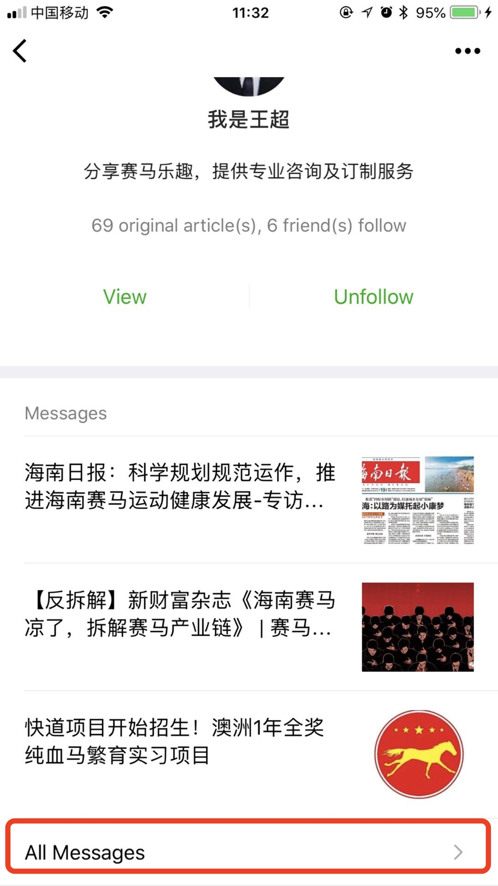
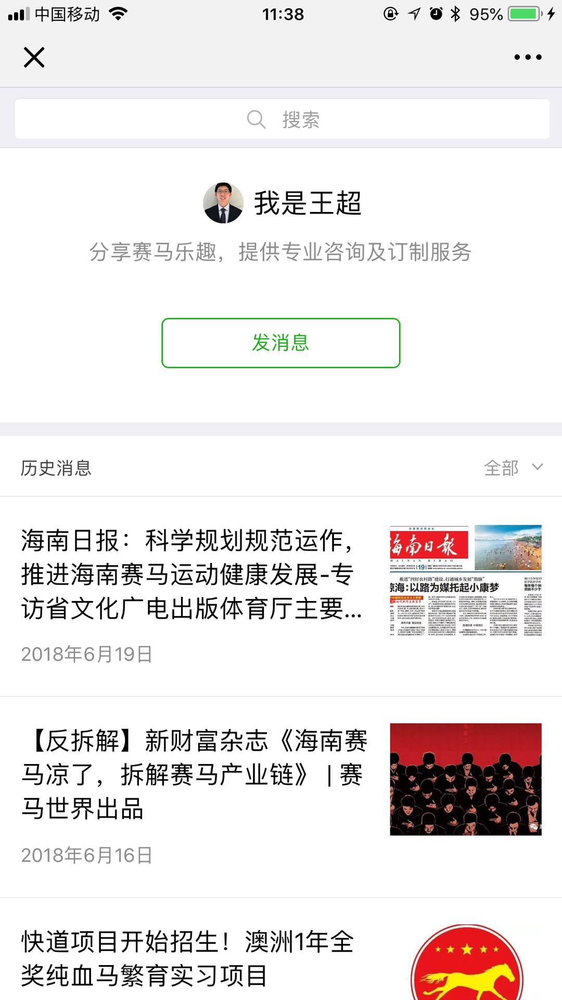
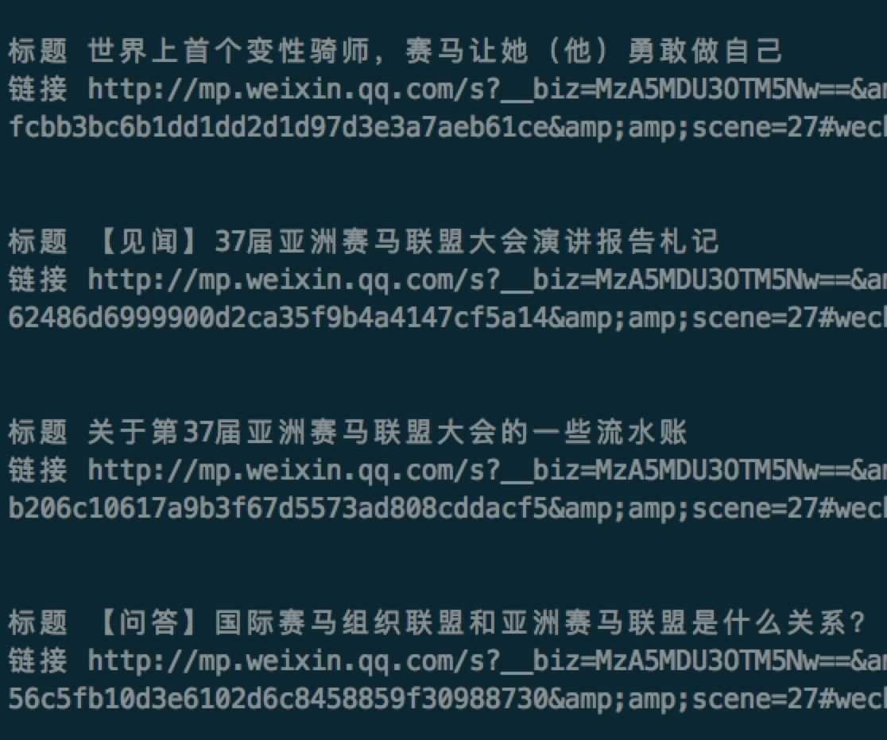
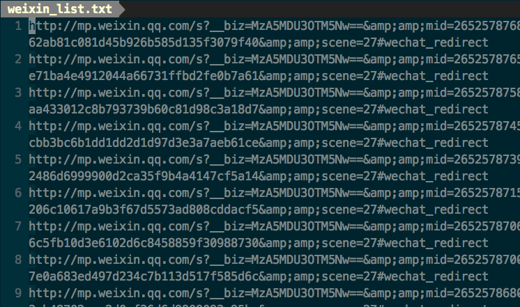

# weixin_spider
使用手机代理方式，[anyproxy](http://anyproxy.io/cn/)来抓取微信公众号相关信息，由于微信采用加密的HTTPS网络传输，所以需要支持https抓取，需要安装证书。
## 安装证书
参考[http://anyproxy.io/cn/#%E4%BB%A3%E7%90%86https](http://anyproxy.io/cn/#%E4%BB%A3%E7%90%86https)
电脑和手机都得安装信任证书
## 抓取微信公众号历史文章
### 启动

    npm install
    npm start

启动后将终端http代理服务器配置为127.0.0.1:8001即可
访问http://127.0.0.1:8002 ，web界面上能看到所有的请求信息
参考[http://anyproxy.io/cn/#%E5%90%AF%E5%8A%A8](http://anyproxy.io/cn/#%E5%90%AF%E5%8A%A8)
### 脚本自动抓取文章并保存

    npm run list_spider

此时需要手动打开微信公众号查看全部历史文章的页面，并手动下拉浏览完所有的文章，此时会自动记录所有公众号历史内容在output/weixin_list.txt下。

